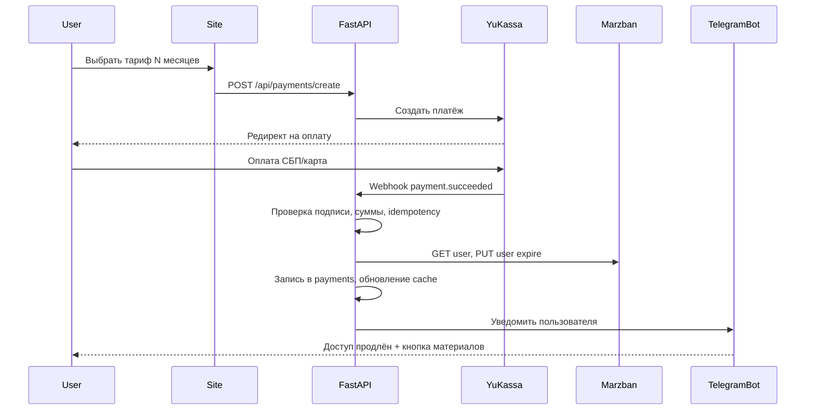

# VXN_Pay — план проекта системы оплаты и Telegram-бота

Документ для передачи в Cursor AI перед началом разработки. Содержит цели, архитектуру, требования и пошаговый план работ.

---

## 1. Зачем этот проект

### Проблема

Сейчас доступ к VPN-сервису (Marzban на отдельном VPS) выдаётся вручную: админ создаёт пользователя в панели, напоминает об оплате сам, продлевает срок вручную. Это неудобно при росте числа пользователей.

### Цель

Сделать **отдельную систему** на **отдельном VPS** и **отдельном домене**, которая:

1. Даёт пользователям **удобный сайт** — войти, увидеть срок доступа, оплатить продление.
2. Принимает оплату через **ЮKassa** (карты РФ, СБП) с **автоматической проверкой** платежа.
3. После успешной оплаты **автоматически продлевает** пользователя в Marzban через API.
4. Ведёт **Telegram-бота** для:
   - индивидуальных напоминаний об окончании срока;
   - новостей и объявлений (рассылка админом);
   - выдачи ссылки на материалы после оплаты.
5. **Не упоминает VPN** на сайте, в платежах и в публичных текстах — нейтральная подача («поддержка авторских материалов / курсов по программированию»). Пользователи и так знают, за что платят.

### Почему отдельный VPS и домен

| Причина | Пояснение |
|---------|-----------|
| Разделение ролей | VPN-сервер (`vxncloud.ru`, порт 443 — Reality) не должен обслуживать платежи и личный кабинет |
| Безопасность | Marzban API не публикуется в интернет; доступ только с billing-VPS по WireGuard |
| Нейтральность | Платёжный сайт на другом домене не связан визуально с `panel.vxncloud.ru` |
| Простота эксплуатации | Падение биллинга не роняет VPN; обновления независимы |

### Что НЕ входит в проект (на старте)

- Публичная регистрация «для всех из интернета» без приглашения.
- Оплата на домене `vxncloud.ru`.
- Telegram Stars как основной способ оплаты (только ЮKassa).
- Использование встроенного admin-бота Marzban для конечных пользователей (он только для админа панели).
- Юридическая консультация — формулировки в чеках согласовать с бухгалтером самостоятельно.

---

## 2. Контекст: уже развёрнутый VPN (firstvds)

Разработчик должен учитывать существующую инфраструктуру. Код VPN лежит в соседней папке репозитория `firstvds/`, на сервере — `/opt/vxncloud/repo`.

| Параметр | Значение |
|----------|----------|
| VPN VPS IP | `132.243.123.55` |
| Домен VPN | `vxncloud.ru` |
| Панель Marzban | `https://panel.vxncloud.ru:8443/dashboard/` |
| Marzban API (локально) | `http://127.0.0.1:8000` |
| Протокол | VLESS + TCP + Reality, порт **443** |
| Nginx HTTPS | порт **8443** (сайт, панель, мониторинг) |
| Subscription prefix | `https://panel.vxncloud.ru:8443` |

**Важно для интеграции:** после оплаты backend должен вызывать Marzban REST API (`PUT /api/user/{username}`) для изменения поля `expire` (Unix timestamp). JWT получается через `POST /api/admin/token`, срок жизни ~1 час — кэшировать ~55 минут.

---

## 3. Принятые решения (не менять без согласования)

| Вопрос | Решение |
|--------|---------|
| Способ оплаты | **ЮKassa** (СБП, карты РФ, webhook) |
| После оплаты | **Автоматическое** продление в Marzban через API |
| Стек backend | **Python FastAPI** |
| Telegram-бот | **aiogram 3** |
| База данных | **PostgreSQL** |
| Деплой | **Docker Compose** на отдельном VPS |
| Связь с Marzban | **WireGuard** между billing-VPS и VPN-VPS |
| Подача на сайте | Нейтральная: «материалы по программированию», без слов VPN/прокси |

---

## 4. Архитектура


### Роли серверов

| Сервер | Что на нём | Чего нет |
|--------|------------|----------|
| VPN VPS (существующий) | Marzban, Xray, мониторинг, nginx :8443 | Сайт оплаты, ЮKassa, пользовательский бот |
| Billing VPS (новый) | Сайт, API, бот, Postgres, webhook | VPN, Marzban, Xray |

### WireGuard (рекомендуемая схема)

- Подсеть: `10.10.0.0/24`
- VPN VPS: `10.10.0.1`
- Billing VPS: `10.10.0.2`
- Backend обращается к Marzban: `http://10.10.0.1:8000/api/...`
- На VPN VPS: разрешить TCP 8000 **только** с интерфейса `wg0` (UFW)
- Marzban по-прежнему слушает `127.0.0.1:8000`; на VPN VPS нужен **проброс или bind** только на wg0 (например `socat`, `iptables DNAT`, или изменение `UVICORN_HOST` на `10.10.0.1` с закрытием снаружи)

**Альтернатива (проще, слабее):** nginx на VPN VPS, `allow <billing_public_ip>; deny all` на отдельном internal location — без WireGuard. Предпочтительнее WireGuard.

---

## 5. Нейтральная подача (обязательные требования к текстам)

### На сайте

- Заголовок: «Авторские материалы по программированию» / «Поддержка образовательного проекта».
- Тарифы: «Доступ к материалам на 1 / 3 / 12 месяцев».
- Кнопки: «Поддержать проект», «Продлить доступ».
- Личный кабинет: статус «активен до ДД.ММ.ГГГГ», «осталось N дней».
- **Не писать:** VPN, прокси, обход блокировок, VLESS, Marzban, Xray.

### В ЮKassa и чеках

- Наименование: «Благодарность за образовательные материалы» или аналог.
- Metadata платежа: внутренние `user_id`, `marzban_username` — не показывать пользователю.

### В Telegram-боте

- Напоминание: «Срок доступа к материалам заканчивается …»
- После оплаты: «Доступ продлён до …» + кнопка «Получить материалы».
- Subscription-ссылка Marzban (`https://panel.vxncloud.ru:8443/sub/...`) — **только в личном сообщении бота**, не на публичных страницах сайта.

### Известный нюанс

Технически subscription-URL указывает на `panel.vxncloud.ru`. На старте это приемлемо (выдача только в боте). Позже можно добавить прокси `https://нейтральный-домен.ru/materials/{token}` на billing-VPS.

---

## 6. Пользовательские сценарии

### 6.1 Первый вход и привязка аккаунта

**Модель на старте:** узкий круг пользователей, админ знает их заранее.

1. Админ создаёт пользователя в Marzban (вручную в панели) **или** система создаёт при первой оплате (`POST /api/user`).
2. Пользователь открывает нейтральный сайт.
3. Вход одним из способов:
   - **Telegram Login Widget** на сайте;
   - или `/start` в боте + ввод одноразового кода с сайта (если виджет неудобен).
4. Привязка: админ заранее вносит `marzban_username` ↔ ожидаемый `telegram_id`, **или** пользователь вводит invite-код, выданный админом.
5. В БД: `users.telegram_id`, `users.marzban_username`, `users.expires_at_cache`.

### 6.2 Оплата и автопродление



**Логика `extend_expire`:**

```text
current = user.expire или 0
base = max(current, now)   # если истёк — считать от сейчас
new_expire = base + period_seconds
PUT /api/user/{username} { "expire": new_expire, "status": "active" }
```

### 6.3 Напоминания об оплате

- Cron ежедневно (например 10:00 Europe/Moscow).
- За **7, 3 и 1 день** до `expires_at` — персональное сообщение в Telegram.
- Таблица `reminder_log` — не слать повторно тот же тип напоминания.
- Кнопка inline «Продлить» → URL сайта с deep-link в личный кабинет.

### 6.4 Новости и объявления

- Админ: команда `/broadcast <текст>` в боте (только `ADMIN_TELEGRAM_IDS`).
- Опционально: форма в `/admin` на сайте.
- Рассылка с паузой ~50 ms между сообщениями (лимит Telegram).
- Лог в `broadcasts`.

---

## 7. Технический стек и структура репозитория

### Стек

| Компонент | Технология |
|-----------|------------|
| API | FastAPI, uvicorn, httpx (Marzban, ЮKassa) |
| ORM | SQLAlchemy 2 + Alembic миграции |
| Бот | aiogram 3.x |
| БД | PostgreSQL 16 |
| Планировщик | APScheduler в процессе API или отдельный worker |
| Reverse proxy | Caddy (авто-SSL) или Nginx + certbot |
| Контейнеризация | Docker Compose |

### Целевая структура папки `VXN_Pay/`

```text
VXN_Pay/
├── README.md
├── ПЛАН-ПРОЕКТА.md          # этот файл
├── docker-compose.yml
├── .env.example
├── backend/
│   ├── Dockerfile
│   ├── pyproject.toml       # или requirements.txt
│   ├── alembic/
│   └── app/
│       ├── main.py
│       ├── config.py
│       ├── db/
│       │   ├── models.py
│       │   └── session.py
│       ├── services/
│       │   ├── marzban.py    # MarzbanClient
│       │   ├── yukassa.py
│       │   ├── billing.py    # extend_expire, create_payment
│       │   └── reminders.py
│       ├── api/
│       │   ├── payments.py
│       │   ├── users.py
│       │   └── admin.py
│       ├── bot/
│       │   ├── main.py
│       │   └── handlers/
│       └── templates/        # Jinja2 HTML
├── web/
│   └── static/               # CSS, JS, изображения
├── infra/
│   ├── caddy/ или nginx/
│   └── wireguard/            # примеры конфигов для обоих VPS
└── docs/
    └── DEPLOY.md
```

---

## 8. Схема базы данных

### Таблица `users`

| Поле | Тип | Описание |
|------|-----|----------|
| id | UUID PK | |
| telegram_id | BIGINT UNIQUE | ID в Telegram |
| marzban_username | VARCHAR UNIQUE | Имя пользователя в Marzban |
| expires_at_cache | TIMESTAMPTZ | Кэш из Marzban, обновляется после оплаты и nightly sync |
| invite_code | VARCHAR NULL | Одноразовый код привязки |
| is_active | BOOLEAN | Мягкое отключение |
| created_at | TIMESTAMPTZ | |

### Таблица `tariffs`

| Поле | Тип | Описание |
|------|-----|----------|
| id | SERIAL PK | |
| name | VARCHAR | «1 месяц», «3 месяца» |
| period_days | INT | 30, 90, 365 |
| price_rub | DECIMAL | Цена в рублях |
| is_active | BOOLEAN | |

### Таблица `payments`

| Поле | Тип | Описание |
|------|-----|----------|
| id | UUID PK | |
| yukassa_payment_id | VARCHAR UNIQUE | Идемпотентность |
| user_id | UUID FK | |
| tariff_id | INT FK | |
| amount | DECIMAL | |
| status | ENUM | pending, succeeded, failed, canceled |
| paid_at | TIMESTAMPTZ NULL | |
| marzban_extended | BOOLEAN | Успешно продлён в Marzban |
| created_at | TIMESTAMPTZ | |

### Таблица `reminder_log`

| Поле | Тип | Описание |
|------|-----|----------|
| id | SERIAL PK | |
| user_id | UUID FK | |
| reminder_type | VARCHAR | 7d, 3d, 1d |
| sent_at | TIMESTAMPTZ | |
| UNIQUE(user_id, reminder_type, expires_at_snapshot) | | Не дублировать на тот же период |

### Таблица `broadcasts`

| Поле | Тип | Описание |
|------|-----|----------|
| id | SERIAL PK | |
| text | TEXT | |
| sent_at | TIMESTAMPTZ | |
| recipient_count | INT | |
| admin_telegram_id | BIGINT | |

### Таблица `marzban_jobs` (очередь retry)

| Поле | Тип | Описание |
|------|-----|----------|
| id | SERIAL PK | |
| payment_id | UUID FK | |
| payload | JSONB | username, new_expire |
| attempts | INT | |
| next_retry_at | TIMESTAMPTZ | |
| status | ENUM | pending, done, failed |

**Зачем `marzban_jobs`:** если WireGuard или Marzban недоступен в момент webhook, платёж уже прошёл — задача повторяется до успеха, админ получает алерт.

---

## 9. Marzban API — спецификация для разработчика

### Аутентификация

```http
POST /api/admin/token
Content-Type: application/x-www-form-urlencoded

username=admin&password=***
```

Ответ: `{ "access_token": "...", "token_type": "bearer" }`

Кэш токена: 55 минут, обновление под `asyncio.Lock`.

### Получить пользователя

```http
GET /api/user/{username}
Authorization: Bearer {token}
```

### Продлить пользователя

```http
PUT /api/user/{username}
Authorization: Bearer {token}
Content-Type: application/json

{
  "expire": 1780000000,
  "status": "active"
}
```

- `expire`: Unix timestamp (секунды).
- `0` = безлимит по времени (не использовать для тарифов).
- Если пользователь expired — всё равно выставить `status: "active"`.

### Создать пользователя (опционально, при первой оплате)

```http
POST /api/user
```

Тело (подстроить под inbound Marzban на VPN-сервере):

```json
{
  "username": "generated_or_invite",
  "proxies": { "vless": { "flow": "" } },
  "inbounds": { "vless": ["VLESS TCP REALITY"] },
  "expire": 1780000000,
  "data_limit": 0,
  "data_limit_reset_strategy": "no_reset",
  "status": "active"
}
```

Имена inbound взять из `firstvds/infra/marzban/xray-core-settings.json`.

### Subscription URL для бота

После `GET /api/user/{username}` в ответе есть `subscription_url` (или собрать из prefix + token). Отправлять пользователю только в private chat бота.

---

## 10. ЮKassa — спецификация

### Подготовка (делает владелец до разработки)

1. Зарегистрировать магазин в [ЮKassa](https://yookassa.ru/) (ИП / самозанятый / ООО).
2. Получить `shop_id` и `secret_key`.
3. В личном кабинете указать URL webhook:  
   `https://{BILLING_DOMAIN}/api/payments/yukassa/webhook`
4. Согласовать текст позиции в чеке (54-ФЗ).

### Создание платежа (backend)

- API ЮKassa: `POST https://api.yookassa.ru/v3/payments`
- `confirmation.type`: `redirect`
- `confirmation.return_url`: страница «спасибо» на billing-сайте
- `metadata`: `{ "user_id": "...", "tariff_id": "..." }`
- `amount`: из таблицы `tariffs`
- `description`: нейтральный текст для пользователя
- `Idempotence-Key`: UUID на каждый запрос создания

### Webhook

- Событие: `payment.succeeded`
- Проверить IP/подпись согласно документации ЮKassa.
- Проверить сумму = тариф.
- Если `yukassa_payment_id` уже в `payments` со статусом `succeeded` — **не продлевать повторно**.
- Иначе: `extend_expire` → Marzban → уведомление в Telegram.

### Тестовый режим

Использовать тестовый shop ЮKassa до продакшена; отдельные ключи в `.env`.

---

## 11. Telegram-бот — команды и поведение

| Команда / действие | Кто | Действие |
|--------------------|-----|----------|
| `/start` | Пользователь | Приветствие, привязка по invite-коду или проверка Telegram Login |
| `/status` | Пользователь | Срок доступа, кнопка «Продлить» |
| `/materials` | Пользователь | Выдать subscription_url если доступ активен |
| `/broadcast` | Админ | Рассылка текста всем пользователям |
| `/sync` | Админ | Принудительная синхронизация expires из Marzban |
| Callback «Продлить» | Пользователь | Ссылка на сайт / оплату |

Переменная `ADMIN_TELEGRAM_IDS` — список numeric ID через запятую.

Бот и API используют **одну БД** и общие сервисы (`billing.py`, `marzban.py`).

---

## 12. Переменные окружения (.env.example)

```env
# App
APP_ENV=production
APP_SECRET_KEY=random-long-string
BILLING_DOMAIN=example-learning.ru

# Database
DATABASE_URL=postgresql+asyncpg://vxnpay:password@db:5432/vxnpay

# Telegram
TELEGRAM_BOT_TOKEN=
ADMIN_TELEGRAM_IDS=123456789

# YuKassa
YUKASSA_SHOP_ID=
YUKASSA_SECRET_KEY=
YUKASSA_WEBHOOK_SECRET=   # если используется

# Marzban (через WireGuard)
MARZBAN_BASE_URL=http://10.10.0.1:8000
MARZBAN_ADMIN_USER=admin
MARZBAN_ADMIN_PASSWORD=

# Site
TELEGRAM_LOGIN_BOT_USERNAME=   # для Login Widget

# Scheduler
REMINDER_CRON_HOUR=10
REMINDER_TIMEZONE=Europe/Moscow
```

**Секреты не коммитить в git.** Добавить `.env` в `.gitignore`.

---

## 13. Инфраструктура billing-VPS

### Минимальные требования

| Ресурс | Значение |
|--------|----------|
| CPU | 1 vCPU |
| RAM | 1 GB |
| Disk | 10 GB SSD |
| ОС | Ubuntu 24.04 LTS |
| Порты | 22 (SSH), 80, 443, 51820/udp (WireGuard) |

### DNS

- Отдельный домен (не `vxncloud.ru`).
- A-запись `@` → IP billing-VPS.
- Опционально `www` → тот же IP.

### Docker Compose (сервисы)

- `db` — PostgreSQL
- `api` — FastAPI + uvicorn
- `bot` — aiogram (или объединить с api)
- `caddy` / `nginx` — reverse proxy, TLS

### Бэкапы

- Ежедневный `pg_dump` в файл или облако.
- Хранить `.env` вне сервера (менеджер паролей).

---

## 14. Изменения на VPN-VPS (firstvds) — минимум

Разработчик готовит инструкцию; применяет владелец или отдельная сессия по `firstvds/`.

1. Установить WireGuard, настроить peer billing-VPS.
2. Открыть Marzban API только на `wg0` (не в публичный интернет).
3. UFW: не добавлять 8000 в публичные правила.
4. Опционально: скрипт `infra/scripts/07-wireguard-marzban-bridge.sh` в репозитории firstvds.

**Не трогать:** Xray 443, nginx 8443, Reality, существующих пользователей.

---

## 15. Фазы разработки (порядок для Cursor)

### Фаза A — Каркас проекта

- [ ] Инициализация структуры `VXN_Pay/` по разделу 7.
- [ ] `docker-compose.yml`, `Dockerfile`, `.env.example`.
- [ ] FastAPI: healthcheck `GET /health`, конфиг из env.
- [ ] PostgreSQL + Alembic, модели `users`, `tariffs`, `payments`.
- [ ] Caddy/Nginx с заглушкой сайта.

**Критерий готовности:** `docker compose up` поднимает API и БД, healthcheck отвечает 200.

### Фаза B — Marzban bridge

- [ ] Документация WireGuard для обоих VPS (`infra/wireguard/`).
- [ ] `services/marzban.py`: token cache, get_user, modify_user, extend_expire.
- [ ] CLI или admin endpoint для тестового продления.
- [ ] Таблица `marzban_jobs` + retry worker.

**Критерий готовности:** с billing-VPS тестовый пользователь продлевается в Marzban.

### Фаза C — Сайт и ЮKassa

- [ ] Нейтральный лендинг (Jinja2 + static).
- [ ] Личный кабинет: статус, кнопка оплаты.
- [ ] Telegram Login Widget или invite-flow.
- [ ] `POST /api/payments/create`, redirect на ЮKassa.
- [ ] Webhook `payment.succeeded`, идемпотентность, вызов extend_expire.
- [ ] Seed тарифов в БД.

**Критерий готовности:** тестовый платёж ЮKassa продлевает пользователя и пишет запись в `payments`.

### Фаза D — Telegram-бот

- [ ] `/start`, привязка, `/status`, `/materials`.
- [ ] Уведомление после успешной оплаты.
- [ ] Напоминания 7/3/1 день (APScheduler).
- [ ] `/broadcast` для админа.

**Критерий готовности:** пользователь получает напоминание и может оплатить через сайт из бота.

### Фаза E — Админка и эксплуатация

- [ ] `/admin` на сайте (Basic Auth или Telegram-only).
- [ ] Список пользователей, платежей, ручное продление.
- [ ] Логирование webhook и ошибок Marzban.
- [ ] Алерт админу в Telegram при failed `marzban_jobs`.
- [ ] `docs/DEPLOY.md` — пошаговый деплой на чистый VPS.

**Критерий готовности:** владелец может управлять системой без SSH-магии.

---

## 16. Риски и митигация

| Риск | Митигация |
|------|-----------|
| Webhook пришёл, Marzban недоступен | Очередь `marzban_jobs`, retry, алерт админу |
| Двойное продление при повторном webhook | UNIQUE `yukassa_payment_id`, проверка статуса |
| Пользователь не привязал Telegram | Оплата только после привязки или invite-код в metadata |
| Subscription URL светит `panel.vxncloud.ru` | Выдача только в боте; прокси — фаза 2 |
| ЮKassa блокирует формулировки | Нейтральные тексты, согласование с бухгалтером |
| Утечка Marzban admin password | Только `.env` на billing-VPS, доступ по WireGuard |

---

## 17. Инструкция для Cursor AI (промпт при старте)

Скопируйте в новый чат Cursor вместе с этим файлом:

```text
Проект: VXN_Pay — биллинг на отдельном VPS.

Контекст: VPN уже работает в соседнем репозитории firstvds (Marzban, panel.vxncloud.ru:8443).
Нужно реализовать систему по ПЛАН-ПРОЕКТА.md:

- Отдельный VPS, нейтральный домен, без упоминания VPN на сайте.
- FastAPI + PostgreSQL + aiogram 3 + Docker Compose.
- ЮKassa с webhook и автопродлением Marzban API через WireGuard.
- Telegram-бот: напоминания, новости, выдача материалов.

Начни с Фазы A. Не меняй код firstvds без явной необходимости.
Секреты только в .env.example как плейсхолдеры.
Пиши на русском в комментариях к коммитам и docs.
После каждой фазы — краткий чеклист что проверить вручную.
```

---

## 18. Чеклист перед продакшеном

- [ ] Тестовые платежи ЮKassa проходят end-to-end.
- [ ] WireGuard поднят, Marzban API не доступен из интернета.
- [ ] Пароли Marzban и ЮKassa не в git.
- [ ] HTTPS на billing-домене валидный.
- [ ] Напоминания уходят в правильный часовой пояс.
- [ ] Админ получает алерт при сбое продления.
- [ ] Бэкап PostgreSQL настроен.
- [ ] Тексты на сайте и в чеках нейтральные.
- [ ] Пользовательский тест: оплата → продление → материалы в боте.

---

*Версия плана: 1.0 · Дата: 2026-06-03 · Связанный VPN-проект: `firstvds/` (VXN Cloud, 132.243.123.55)*
