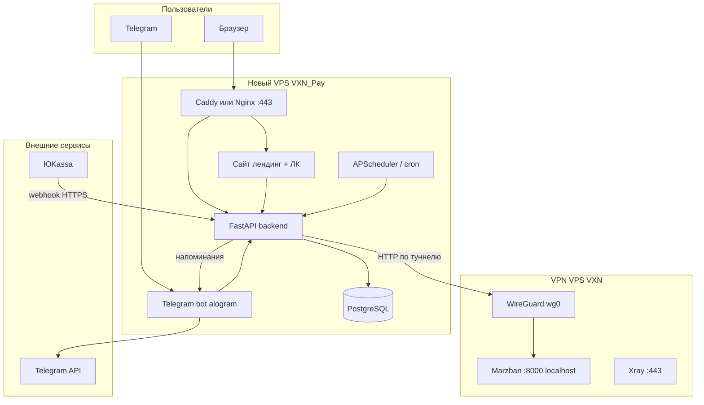
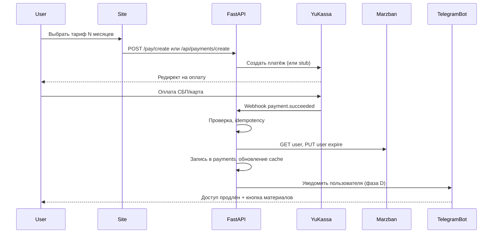

# VXN_Pay — план проекта системы оплаты и Telegram-бота

Документ для передачи в Cursor AI и ведения дорожной карты.  
**Актуализирован под реализацию:** июль 2026 · версия плана **1.1**.

> **Краткий статус:** каркас FastAPI + PostgreSQL, кабинеты admin/manager/user, invite-flow, Marzban CRUD/import, stub-оплата — **готовы**.  
> Продакшен-ЮKassa, Telegram-бот, billing-VPS — **ещё в плане**.  
> Оперативное описание: [README.md](./README.md).

---

## 0. Текущее состояние реализации

### Сделано

| Компонент | Детали |
|-----------|--------|
| Docker Compose | `db` (Postgres 16) + `api` (uvicorn, Alembic при старте) |
| Миграции | `001`…`005` (роли, категории, invites, email nullable) |
| Роли | `admin`, `manager`, `user` + ACL и `manager_assignments` |
| Сайт tip My Code | Главная (логин), `/admin`, `/manager`, `/cabinet` |
| Invite | `/invite/{token}`: пароль + почта; повторная ссылка после сброса пароля |
| Marzban | create/modify/delete/list, token cache, import из панели |
| Тарифы | Льготная 75/225; коммерческая 500/1500 |
| Оплата | Создание платежа + stub ЮKassa; продление через billing/Marzban jobs |
| Почта | Поле nullable; не автозаполняется; задаётся в invite/кабинете |
| UI | Строгий светлый стиль, таблица CSS Grid, иконки действий |

### Не сделано / заглушки

- Реальная ЮKassa (сейчас `YUKASSA_STUB_MODE=true`)
- Рабочий SMTP (переменные есть, без хоста письма не уходят)
- Telegram-бот (aiogram)
- Caddy/Nginx + TLS на billing-домене
- Полноценный WireGuard на продакшен billing-VPS (локально — SSH-туннель)

### Локальная разработка Marzban

```text
SSH-туннель → host.docker.internal:18000 → Marzban :8000
MARZBAN_BASE_URL=http://host.docker.internal:18000
```

Открытие кабинетов admin/manager **не** делает массовый sync с Marzban (кэш в БД). Sync — при сохранении, «Синхронизировать из Marzban», оплате.

---

## 1. Зачем этот проект


### Проблема

Сейчас доступ к VPN-сервису (Marzban на отдельном VPS) выдаётся вручную: админ создаёт пользователя в панели, напоминает об оплате сам, продлевает срок вручную. Это неудобно при росте числа пользователей.

### Цель

Сделать **отдельную систему** на **отдельном VPS** и **отдельном домене**, которая:

1. Даёт пользователям **удобный сайт** — войти, увидеть срок доступа, оплатить продление.
2. Принимает оплату через **ЮKassa** (карты РФ, СБП) с **автоматической проверкой** платежа.
3. После успешной оплаты **автоматически продлевает** пользователя в Marzban через API.
4. Ведёт **Telegram-бота** для:
   - индивидуальных напоминаний об окончании срока;
   - новостей и объявлений (рассылка админом);
   - выдачи ссылки на материалы после оплаты.
5. **Не упоминает VPN** на сайте, в платежах и в публичных текстах — нейтральная подача («поддержка авторских материалов / курсов по программированию»). Пользователи и так знают, за что платят.

### Почему отдельный VPS и домен

| Причина | Пояснение |
|---------|-----------|
| Разделение ролей | VPN-сервер (`vxncloud.ru`, порт 443 — Reality) не должен обслуживать платежи и личный кабинет |
| Безопасность | Marzban API не публикуется в интернет; доступ только с billing-VPS по WireGuard |
| Нейтральность | Платёжный сайт на другом домене не связан визуально с `panel.vxncloud.ru` |
| Простота эксплуатации | Падение биллинга не роняет VPN; обновления независимы |

### Что НЕ входит в проект (на старте)

- Публичная регистрация «для всех из интернета» без приглашения.
- Оплата на домене `vxncloud.ru`.
- Telegram Stars как основной способ оплаты (только ЮKassa).
- Использование встроенного admin-бота Marzban для конечных пользователей (он только для админа панели).
- Юридическая консультация — формулировки в чеках согласовать с бухгалтером самостоятельно.

---

## 2. Контекст: уже развёрнутый VPN (VXN)

Разработчик должен учитывать существующую инфраструктуру. Код VPN лежит в соседней папке репозитория `VXN/`, на сервере — `/opt/vxncloud/repo`.

| Параметр | Значение |
|----------|----------|
| VPN VPS IP | `132.243.123.55` |
| Домен VPN | `vxncloud.ru` |
| Панель Marzban | `https://panel.vxncloud.ru:8443/dashboard/` |
| Marzban API (локально) | `http://127.0.0.1:8000` |
| Протокол | VLESS + TCP + Reality, порт **443** |
| Nginx HTTPS | порт **8443** (сайт, панель, мониторинг) |
| Subscription prefix | `https://panel.vxncloud.ru:8443` |

**Важно для интеграции:** после оплаты backend должен вызывать Marzban REST API (`PUT /api/user/{username}`) для изменения поля `expire` (Unix timestamp). JWT получается через `POST /api/admin/token`, срок жизни ~1 час — кэшировать ~55 минут.

---

## 3. Принятые решения (не менять без согласования)

| Вопрос | Решение |
|--------|---------|
| Способ оплаты | **ЮKassa** (СБП, карты РФ, webhook) |
| После оплаты | **Автоматическое** продление в Marzban через API |
| Стек backend | **Python FastAPI** |
| Telegram-бот | **aiogram 3** |
| База данных | **PostgreSQL** |
| Деплой | **Docker Compose** на отдельном VPS |
| Связь с Marzban | **WireGuard** между billing-VPS и VPN-VPS |
| Подача на сайте | Нейтральная: «материалы по программированию», без слов VPN/прокси |

---

## 4. Архитектура



### Роли серверов

| Сервер | Что на нём | Чего нет |
|--------|------------|----------|
| VPN VPS (существующий) | Marzban, Xray, мониторинг, nginx :8443 | Сайт оплаты, ЮKassa, пользовательский бот |
| Billing VPS (новый) | Сайт, API, бот, Postgres, webhook | VPN, Marzban, Xray |

### WireGuard (рекомендуемая схема)

- Подсеть: `10.10.0.0/24`
- VPN VPS: `10.10.0.1`
- Billing VPS: `10.10.0.2`
- Backend обращается к Marzban: `http://10.10.0.1:8000/api/...`
- На VPN VPS: разрешить TCP 8000 **только** с интерфейса `wg0` (UFW)
- Marzban по-прежнему слушает `127.0.0.1:8000`; на VPN VPS нужен **проброс или bind** только на wg0 (например `socat`, `iptables DNAT`, или изменение `UVICORN_HOST` на `10.10.0.1` с закрытием снаружи)

**Альтернатива (проще, слабее):** nginx на VPN VPS, `allow <billing_public_ip>; deny all` на отдельном internal location — без WireGuard. Предпочтительнее WireGuard.

---

## 5. Нейтральная подача (обязательные требования к текстам)

### На сайте

- Заголовок: «Авторские материалы по программированию» / «Поддержка образовательного проекта».
- Тарифы: «Доступ к материалам на 1 / 3 / 12 месяцев».
- Кнопки: «Поддержать проект», «Продлить доступ».
- Личный кабинет: статус «активен до ДД.ММ.ГГГГ», «осталось N дней».
- **Не писать:** VPN, прокси, обход блокировок, VLESS, Marzban, Xray.

### В ЮKassa и чеках

- Наименование: «Благодарность за образовательные материалы» или аналог.
- Metadata платежа: внутренние `user_id`, `marzban_username` — не показывать пользователю.

### В Telegram-боте

- Напоминание: «Срок доступа к материалам заканчивается …»
- После оплаты: «Доступ продлён до …» + кнопка «Получить материалы».
- Subscription-ссылка Marzban — в **личном кабинете** (кнопка копирования) и позже в боте. На публичном лендинге не светить.

### Известный нюанс

Технически subscription-URL указывает на `panel.vxncloud.ru`. На старте это приемлемо (выдача только в боте). Позже можно добавить прокси `https://нейтральный-домен.ru/materials/{token}` на billing-VPS.

---

## 6. Пользовательские сценарии

### 6.1 Создание аккаунта и invite (реализовано)

**Модель:** узкий круг; публичной регистрации нет.

1. Админ или менеджер создаёт пользователя: **логин** + **категория** (почта не обязательна).
2. Логин проверяется по правилам Marzban (3–32, `a-z0-9_`).
3. Создаётся пользователь в Marzban и запись на сайте (`password_set=false`).
4. Менеджер при создании автоматически получает пользователя в подопечные.
5. Копируется invite-ссылка → пользователь задаёт пароль и почту на `/invite/{token}`.
6. Если пароль уже задан — форма не показывается; нужна новая ссылка после «Удалить пароль».

Вход на сайт: **логин + пароль** (не Telegram Login Widget — отложено).

### 6.2 Оплата и автопродление



**Логика `extend_expire`:**

```text
current = user.expire или 0
base = max(current, now)   # если истёк — считать от сейчас
new_expire = base + period_seconds
PUT /api/user/{username} { "expire": new_expire, "status": "active" }
```

**Сейчас:** stub-режим ЮKassa; менеджер может оплатить за подопечного (`target_user_id`).

### 6.3 Напоминания об оплате

- Cron ежедневно (например 10:00 Europe/Moscow).
- За **7, 3 и 1 день** до `expires_at` — персональное сообщение в Telegram.
- Таблица `reminder_log` — не слать повторно тот же тип напоминания.
- Кнопка inline «Продлить» → URL сайта с deep-link в личный кабинет.

*(Фаза D — не реализовано.)*

### 6.4 Новости и объявления

- Админ: команда `/broadcast <текст>` в боте (только `ADMIN_TELEGRAM_IDS`).
- Опционально: форма в `/admin` на сайте.
- Рассылка с паузой ~50 ms между сообщениями (лимит Telegram).
- Лог в `broadcasts`.

*(Фаза D — не реализовано.)*

### 6.5 Кабинеты (реализовано)

| Кабинет | Функции |
|---------|---------|
| `/admin` | Таблица всех (кроме bootstrap admin), фильтр по логину, CRUD, категория, статус Marzban, invite, сброс пароля, импорт Marzban, назначение менеджеров |
| `/manager` | Подопечные + свой аккаунт, создание пользователей, оплата за них, invite, сброс пароля |
| `/cabinet` | Срок, subscription URL (копирование), почта, оплата, сброс пароля через email |

Приложения и инструкции: `/docs/windows|android|ios`, заглушки в `static/apps/`.

---

## 7. Технический стек и структура репозитория

### Стек

| Компонент | Технология |
|-----------|------------|
| API + HTML | FastAPI, Jinja2, uvicorn, httpx |
| ORM | SQLAlchemy 2 + Alembic |
| Бот | aiogram 3.x *(план)* |
| БД | PostgreSQL 16 |
| Планировщик | APScheduler / worker *(частично: marzban_jobs)* |
| Reverse proxy | Caddy или Nginx + certbot *(план)* |
| Контейнеризация | Docker Compose |

### Фактическая структура `VXN_Pay/`

```text
VXN_Pay/
├── README.md
├── ПЛАН-ПРОЕКТА.md
├── docker-compose.yml
├── .env.example
├── backend/
│   ├── Dockerfile
│   ├── pyproject.toml
│   ├── alembic/
│   │   └── versions/          # 001…005
│   └── app/
│       ├── main.py
│       ├── config.py
│       ├── db/
│       ├── models/            # user, tariff, payment, marzban_job…
│       ├── schemas/
│       ├── services/
│       │   ├── marzban.py
│       │   ├── accounts.py    # CRUD + invite + clear password
│       │   ├── acl.py
│       │   ├── billing.py
│       │   ├── yukassa.py
│       │   ├── email.py
│       │   └── connections.py
│       ├── api/               # REST
│       ├── web/               # HTML routes, helpers, deps
│       ├── templates/
│       ├── static/css, apps/
│       └── workers/
├── infra/wireguard/
└── docs/                      # DEPLOY.md — ещё не создан
```

---

## 8. Схема базы данных (актуально)

### Таблица `users`

| Поле | Тип | Описание |
|------|-----|----------|
| id | UUID PK | |
| login | VARCHAR UNIQUE | Логин сайта (= обычно username Marzban) |
| password_hash | VARCHAR | |
| email | VARCHAR NULL | Задаётся в invite / кабинете |
| phone | VARCHAR NULL | |
| role | ENUM | admin, manager, user |
| tariff_category | ENUM | preferential, commercial |
| comments | TEXT NULL | Примечание |
| is_active | BOOLEAN | |
| email_verified_at | TIMESTAMPTZ NULL | |
| password_set | BOOLEAN | false до прохождения invite |
| created_at / updated_at | TIMESTAMPTZ | |

### Таблица `user_account_links`

| Поле | Тип | Описание |
|------|-----|----------|
| id | SERIAL PK | |
| user_id | UUID FK | |
| account_username | VARCHAR UNIQUE | Имя в Marzban |
| status_cache | VARCHAR | |
| expires_at_cache | TIMESTAMPTZ | |
| subscription_url_cache | TEXT | |
| data_limit_cache / data_used_cache | BIGINT | |
| last_synced_at | TIMESTAMPTZ | |

### Таблица `tariffs`

| Поле | Тип | Описание |
|------|-----|----------|
| id | SERIAL PK | |
| name | VARCHAR | |
| period_days | INT | 30, 90 |
| price_rub | DECIMAL | |
| category | ENUM | preferential / commercial |
| is_active | BOOLEAN | |

### Таблицы токенов

- `invite_tokens` — одноразовые invite
- `password_reset_tokens` — сброс пароля по почте
- `email_verification_tokens` — подтверждение почты

### Таблица `manager_assignments`

| Поле | Тип | Описание |
|------|-----|----------|
| manager_user_id | UUID FK | |
| managed_user_id | UUID FK | |
| UNIQUE(manager, managed) | | |

### Таблицы `payments`, `reminder_log`, `marzban_jobs`

Без существенных изменений относительно исходного плана (см. ниже кратко).

#### `payments`

| Поле | Тип | Описание |
|------|-----|----------|
| id | UUID PK | |
| yukassa_payment_id | VARCHAR UNIQUE | Идемпотентность |
| user_id | UUID FK | |
| tariff_id | INT FK | |
| amount | DECIMAL | |
| status | ENUM | pending, succeeded, failed, canceled |
| paid_at | TIMESTAMPTZ NULL | |
| marzban_extended | BOOLEAN | |
| created_at | TIMESTAMPTZ | |

#### `marzban_jobs`

Очередь retry при недоступности Marzban после оплаты.

---

## 9. Marzban API — спецификация для разработчика

### Аутентификация

```http
POST /api/admin/token
Content-Type: application/x-www-form-urlencoded

username=admin&password=***
```

Ответ: `{ "access_token": "...", "token_type": "bearer" }`

Кэш токена: 55 минут, обновление под `asyncio.Lock`.

### Получить пользователя

```http
GET /api/user/{username}
Authorization: Bearer {token}
```

### Продлить пользователя

```http
PUT /api/user/{username}
Authorization: Bearer {token}
Content-Type: application/json

{
  "expire": 1780000000,
  "status": "active"
}
```

- `expire`: Unix timestamp (секунды).
- `0` = безлимит по времени (не использовать для тарифов).
- Если пользователь expired — всё равно выставить `status: "active"`.

### Создать пользователя (опционально, при первой оплате)

```http
POST /api/user
```

Тело (подстроить под inbound Marzban на VPN-сервере):

```json
{
  "username": "generated_or_invite",
  "proxies": { "vless": { "flow": "" } },
  "inbounds": { "vless": ["VLESS TCP REALITY"] },
  "expire": 1780000000,
  "data_limit": 0,
  "data_limit_reset_strategy": "no_reset",
  "status": "active"
}
```

Имена inbound взять из `VXN/install/deploy/infra/marzban/xray-core-settings.json`.

### Subscription URL для бота

После `GET /api/user/{username}` в ответе есть `subscription_url` (или собрать из prefix + token). Отправлять пользователю только в private chat бота.

---

## 10. ЮKassa — спецификация

### Подготовка (делает владелец до разработки)

1. Зарегистрировать магазин в [ЮKassa](https://yookassa.ru/) (ИП / самозанятый / ООО).
2. Получить `shop_id` и `secret_key`.
3. В личном кабинете указать URL webhook:  
   `https://{BILLING_DOMAIN}/api/payments/yukassa/webhook`
4. Согласовать текст позиции в чеке (54-ФЗ).

### Создание платежа (backend)

- API ЮKassa: `POST https://api.yookassa.ru/v3/payments`
- `confirmation.type`: `redirect`
- `confirmation.return_url`: страница «спасибо» на billing-сайте
- `metadata`: `{ "user_id": "...", "tariff_id": "..." }`
- `amount`: из таблицы `tariffs`
- `description`: нейтральный текст для пользователя
- `Idempotence-Key`: UUID на каждый запрос создания

### Webhook

- Событие: `payment.succeeded`
- Проверить IP/подпись согласно документации ЮKassa.
- Проверить сумму = тариф.
- Если `yukassa_payment_id` уже в `payments` со статусом `succeeded` — **не продлевать повторно**.
- Иначе: `extend_expire` → Marzban → уведомление в Telegram.

### Тестовый режим

Использовать тестовый shop ЮKassa до продакшена; отдельные ключи в `.env`.

---

## 11. Telegram-бот — команды и поведение

| Команда / действие | Кто | Действие |
|--------------------|-----|----------|
| `/start` | Пользователь | Приветствие, привязка по invite-коду или проверка Telegram Login |
| `/status` | Пользователь | Срок доступа, кнопка «Продлить» |
| `/materials` | Пользователь | Выдать subscription_url если доступ активен |
| `/broadcast` | Админ | Рассылка текста всем пользователям |
| `/sync` | Админ | Принудительная синхронизация expires из Marzban |
| Callback «Продлить» | Пользователь | Ссылка на сайт / оплату |

Переменная `ADMIN_TELEGRAM_IDS` — список numeric ID через запятую.

Бот и API используют **одну БД** и общие сервисы (`billing.py`, `marzban.py`).

---

## 12. Переменные окружения

Актуальный полный список — в **`.env.example`**. Ключевые группы:

- App / JWT / bootstrap admin
- PostgreSQL
- SMTP
- ЮKassa (`YUKASSA_STUB_MODE`)
- Marzban (`MARZBAN_BASE_URL`, кэш токена, TTL sync ЛК)
- Site (`SITE_BASE_URL`, `COOKIE_SECURE`)
- Telegram *(зарезервировано)*

**Секреты не коммитить.** `.env` в `.gitignore`.

---

## 13. Инфраструктура billing-VPS

### Минимальные требования

| Ресурс | Значение |
|--------|----------|
| CPU | 1 vCPU |
| RAM | 1 GB |
| Disk | 10 GB SSD |
| ОС | Ubuntu 24.04 LTS |
| Порты | 22 (SSH), 80, 443, 51820/udp (WireGuard) |

### DNS

- Отдельный домен (не `vxncloud.ru`).
- A-запись `@` → IP billing-VPS.
- Опционально `www` → тот же IP.

### Docker Compose (сервисы)

- `db` — PostgreSQL
- `api` — FastAPI + uvicorn
- `bot` — aiogram (или объединить с api)
- `caddy` / `nginx` — reverse proxy, TLS

### Бэкапы

- Ежедневный `pg_dump` в файл или облако.
- Хранить `.env` вне сервера (менеджер паролей).

---

## 14. Изменения на VPN-VPS (VXN) — минимум

Разработчик готовит инструкцию; применяет владелец или отдельная сессия по `VXN/`.

1. Установить WireGuard, настроить peer billing-VPS.
2. Открыть Marzban API только на `wg0` (не в публичный интернет).
3. UFW: не добавлять 8000 в публичные правила.
4. Опционально: скрипт `install/deploy/infra/scripts/07-wireguard-marzban-bridge.sh` в репозитории VXN.

**Не трогать:** Xray 443, nginx 8443, Reality, существующих пользователей.

---

## 15. Фазы разработки (порядок для Cursor)

### Фаза A — Каркас проекта ✅

- [x] Инициализация структуры `VXN_Pay/`
- [x] `docker-compose.yml`, `Dockerfile`, `.env.example`
- [x] FastAPI: healthcheck, конфиг из env
- [x] PostgreSQL + Alembic, базовые модели
- [ ] Caddy/Nginx с TLS на billing-домене *(продакшен)*

**Критерий:** `docker compose up` поднимает API и БД — **выполнено**.

### Фаза B — Marzban bridge ✅ (локально / туннель)

- [x] Документация WireGuard (`infra/wireguard/`)
- [x] `services/marzban.py`: token cache, get/create/modify/delete/list, subscription URL
- [x] Admin: импорт из Marzban, сохранение с sync
- [x] Таблица `marzban_jobs` + worker
- [ ] Постоянный WireGuard на billing-VPS *(продакшен)*

**Критерий локально:** продление/CRUD через SSH-туннель — **выполнено**.

### Фаза C — Сайт и оплата 🟡 частично

- [x] Нейтральный лендинг tip My Code (Jinja2 + CSS)
- [x] Кабинеты admin / manager / user
- [x] Invite-flow (логин/пароль, без Telegram Login Widget)
- [x] Создание платежа, stub ЮKassa, продление
- [x] Seed тарифов по категориям
- [ ] Продакшен-ЮKassa webhook end-to-end
- [ ] Рабочий SMTP

**Критерий stub:** оплата в тестовом режиме продлевает доступ — **в основном готово**.  
**Критерий прод:** реальный webhook ЮKassa — **нет**.

### Фаза D — Telegram-бот ❌

- [ ] `/start`, привязка, `/status`, `/materials`
- [ ] Уведомление после оплаты
- [ ] Напоминания 7/3/1 день
- [ ] `/broadcast` для админа

### Фаза E — Админка и эксплуатация 🟡 частично

- [x] `/admin`, `/manager` (роли, ACL, не Basic Auth)
- [x] Список пользователей, ручное управление, invite, сброс пароля
- [ ] Полный UI платежей / алерты в Telegram
- [ ] `docs/DEPLOY.md`
- [ ] Бэкапы PostgreSQL на billing-VPS

---

## 16. Риски и митигация

| Риск | Митигация |
|------|-----------|
| Webhook пришёл, Marzban недоступен | Очередь `marzban_jobs`, retry, алерт админу |
| Двойное продление при повторном webhook | UNIQUE `yukassa_payment_id`, проверка статуса |
| Пользователь не привязал Telegram | Оплата только после привязки или invite-код в metadata |
| Subscription URL светит `panel.vxncloud.ru` | Выдача только в боте; прокси — фаза 2 |
| ЮKassa блокирует формулировки | Нейтральные тексты, согласование с бухгалтером |
| Утечка Marzban admin password | Только `.env` на billing-VPS, доступ по WireGuard |

---

## 17. Инструкция для Cursor AI (промпт при продолжении)

```text
Проект: VXN_Pay — биллинг tip My Code.

Контекст: часть плана уже реализована (см. README.md и §0 ПЛАН-ПРОЕКТА.md):
кабинеты admin/manager/user, invite-flow, Marzban, stub-оплата.

VPN уже работает в соседнем репозитории VXN.
Не меняй код VXN без явной необходимости.
Секреты только в .env (не коммитить); в .env.example — плейсхолдеры.

Дальше по приоритету (если не указано иное):
1) продакшен ЮKassa + webhook;
2) SMTP;
3) Telegram-бот (фаза D);
4) DEPLOY.md и billing-VPS.

Пиши комментарии в коде и коммиты на русском.
```

---

## 18. Чеклист перед продакшеном

- [ ] Тестовые платежи ЮKassa проходят end-to-end.
- [ ] WireGuard поднят, Marzban API не доступен из интернета.
- [ ] Пароли Marzban и ЮKassa не в git.
- [ ] HTTPS на billing-домене валидный; `COOKIE_SECURE=true`.
- [ ] SMTP работает (invite, reset, verify).
- [ ] Напоминания уходят в правильный часовой пояс *(после бота)*.
- [ ] Админ получает алерт при сбое продления.
- [ ] Бэкап PostgreSQL настроен.
- [ ] Тексты на сайте и в чеках нейтральные.
- [ ] Пользовательский тест: invite → вход → оплата → продление.

---

*Версия плана: 1.1 · Дата: 2026-07-24 · Связанный VPN-проект: `VXN/` (VXN Cloud, 132.243.123.55)*
